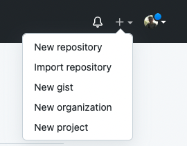
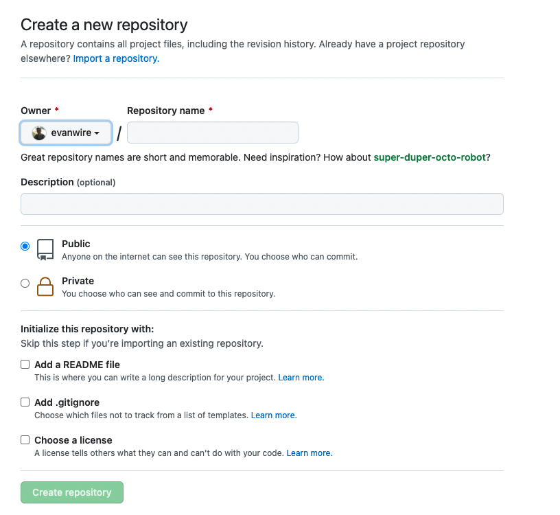
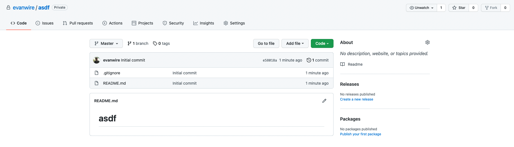
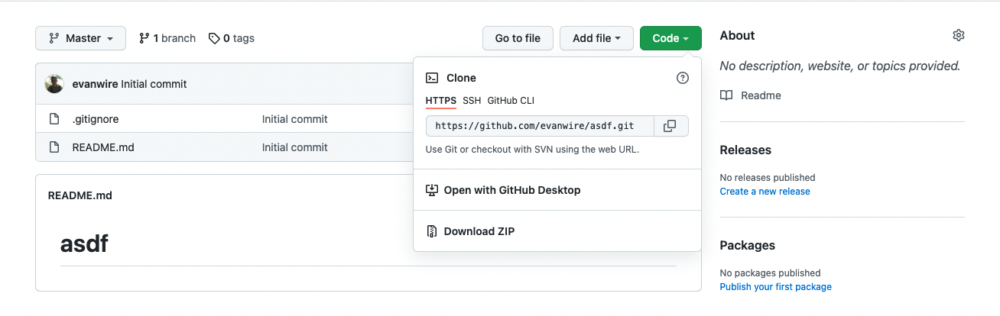
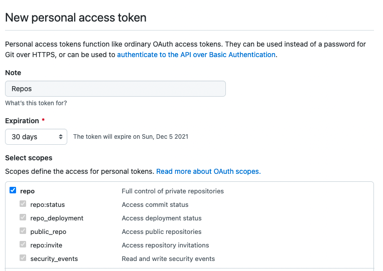

# How to create a repo and communicate with it from the command line
The first step would require you to go to github.com and either log in or create an account. I suggest, when making your account, you make your username something that you would not mind if employers saw. As you begin to interact with your github, it would be worthwhile to give the link to your profile in your job applications if they provide a field for you to give links to any miscellaneous websites.

Once you are logged into your account, you have two options when it comes to creating a repository:
1. Create a local repository, then connect it to a remote repository hosted on github
2. Create a repository using the github UI, then clone it to create a local instance

**I will be going over the second option.**

In order to create your repository, find the plus button at the top right of github.com. Clicking on it should show this:

Select the "New repository" option. You will be brought a screen that looks like this:

Fill in the fields in a brief yet informative manner. Set it to public if you want outside people to see it, or private if you wish to only have select people access the repository. I would suggest checking the boxes to add a README.md file and a .gitignore, as these files will be useful later as you begin to contribute code to your repository. 

If you check the box to add a .gitignore, you will be provided the option to select a template. I suggest choosing the template that corresponds to the language/framework you will be using in your project, as this will provide a boilerplate .gitignore that automatically ignores the files that one wouldn't need to save to their remote repository (i.e. the Java template automatically has a line that ignores all .class files).

Finally, you can choose to select a lincense. If you are writing a school project, this isn't as necessary. However, if you are writing, say, a new Python library or a useful productivity tool, adding a license would detail to any github user whether they can use your code, and for what purpose.

Now you can click the Create Repository button, and you will be brought to a screen that looks like this:

The navbar at the top provides a lot of functionality that is slightly out of the scope of this discussion. However, I suggest you investigate these for yourself, especcially the Pull Requests and Issues tabs as they are used in industry/open source a lot.

Aside from the navbar, you can see a lot of information about your repository here. The main things to be concerned with is the list of files in your repository, and the green button that reads Code. Clicking this button will provide a popup menu, which gives multiple ways to reference your remote repository from your local machine:

Before you can clone your repository, you will need to generate a personal access token. Click the dropdown in the top right with your profile picture, then hit Settings->Developer Settings->Personal Access Tokens. Click Generate New Token button, provide a brief description of what this token is for (I usually just write "Repos"), and select how long you want this token to last. Finally, click the checkbox that reads "repos". At the end, your screen should look like this:

Now scroll to the bottom and hit Generate Token. This token will allow you to verify your github creentials when attempting to communicate with your remote repository from your local machine.

We are now ready to clone the new repository. Navigate back to the repository's home page, and click the green button again that reads "Code." Copy the HTTPS link, that should look something like https://github.com/USERNAME/PROJECT_NAME.git. Now open your terminal, and navigate to where you want this repository to go (i.e. navigate to your Projects folder, or something similar). Note that this will create a new folder on your computer, so there is no need to make a directory called PROJECT_NAME prior to cloning.

Once you are in a spot where you want this repository to live, type *git clone* and paste the HTTPS link you copied earlier.

Now, you will be prompted to provide your github login information. Here you would type your github username, then in the next field, go back and copy your personal access token and paste that. Upon completion of this step, the repository should be cloned onto your local machine.

From this point onwards, you can communicate with the remote the same way you did for the remote repositories used in class. The same *git commit* *git push* *git pull* commands will work. However, now you will have the benefit of being able to go to github.com and viewing the files, branches, commit history, etc. of your repository using an intuitive UI instead of your command line. 