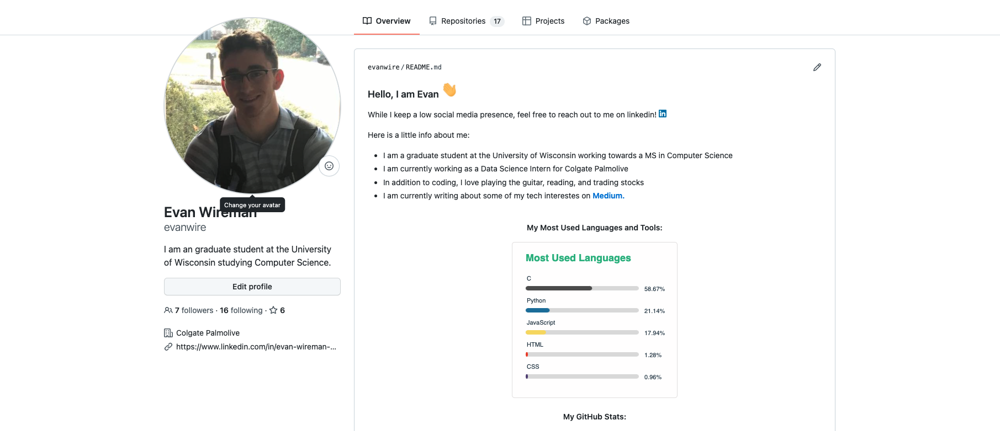

# How to design an attractive github profile

Designing an attractive github profile can honestly be a pretty fun process. This can also be quite impressive to any employers or peers that come and visit one's profile, as they will be greeted by a colorful, aesthetic landing screen. Some examples of attractive github profiles can be found here: https://github.com/abhisheknaiidu/awesome-github-profile-readme

In order to customize your profile, you would have to create a README in a repository with the same name as your github profile. For instance, my github username is evanwire, thus my profile README is stored in a repository titled evanwire. This README is then displayed on your profile when people view it. It will look something like this:


Note that github READMEs are written in Markdown. This makes it easy to cleanly format and organize your README. A Markdown syntax guide can be found here: https://www.markdownguide.org/basic-syntax/

You can also write HTML/CSS to gain even more controllability over how your README looks. The link above provides HTML equivalents to all Markdown syntax. If you wish to add CSS to customize your page even further, you can do so by adding style tags to your page. For instance:

```
<style>
.red_text{
    color:red;
}
</style>

<p class="red_text">This is now red</p>
```

Renders to:

<style>
.red_text{
    color:red;
}
</style>

<p class="red_text">This is now red</p>

There is no need to create an incredibly detailed profile such as the ones found in the link above. However, there are some things it is important to include in one's profile. These things are:
* A greeting. Github is not meant to be a professional site. While employers may view your profile, the main purpose of your profile README should be to introduce yourself to other developers. You can do this by showing a glimpse into who you are and what your interests are.
* Your top skills. This can be done in a number of ways. I choose to use an auto-generated stat tracker, which shows my most used languages in a histogram. If you would like to use the same tool, the documentation can be found here: https://github.com/anuraghazra/github-readme-stats
* Links to other relevant sites. While this is not crucial, you may have a personal website, or a project that you are proud of that can be found online. In either case, it is a good idea to showcase these on your README. You can also pin repositories you are proud of to your profile, so they are the first repos anyone sees who visits your page. Instructions on how to do so can be found here: https://docs.github.com/en/account-and-profile/setting-up-and-managing-your-github-profile/customizing-your-profile/pinning-items-to-your-profile