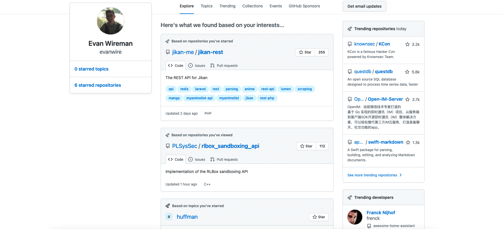

# How to find open source projects

There are plenty of cool projects to learn from and contribute towards, regardless of your skill level. On the main landing page of github.com, at the top there is a button that reads Explore. Clicking this button brings you to the following screen:

The tabs at the top show various things:
* Explore: Suggested repositories based on your previous searches, as well as trending repositories
* Topics: Groups repositories together based on programming languages or project type (i.e. compilers, API's, etc.)
* Trending: See what other developers are looking at today.
* Collections: Curated lists and insight into various industries and communities, often more niche than Topics (i.e. Pixel Art Tools, Hacking Minecraft, etc.)
* Events: Connect with the GitHub community at conferences, meetups, and hackathons around the world.
* GitHub Sponsors: Fund the work of developers and projects you depend on.

Frequently checking in with the open source community is a great way to learn, connect, find inspiration, and ultimately appreciate coding for more than just typing words into VSCode.

Some notable open source projects:
* Linux: Yes, the operating system. You can literally read all of the source code here: https://github.com/torvalds/linux
* Django: A high-level Python Web framework that promotes rapid development: https://github.com/django/django
* Tensorflow: An end-to-end machine platform for machine learning: https://github.com/tensorflow/tensorflow
* GCC: The standard compilers used for C and C++ code: https://github.com/gcc-mirror/gcc
* Quake 3: A first-person shooter multiplayer-focused 3D game that was pretty popular back around the year 2000, reaching $10.1 million in revenue: https://github.com/id-Software/Quake-III-Arena

