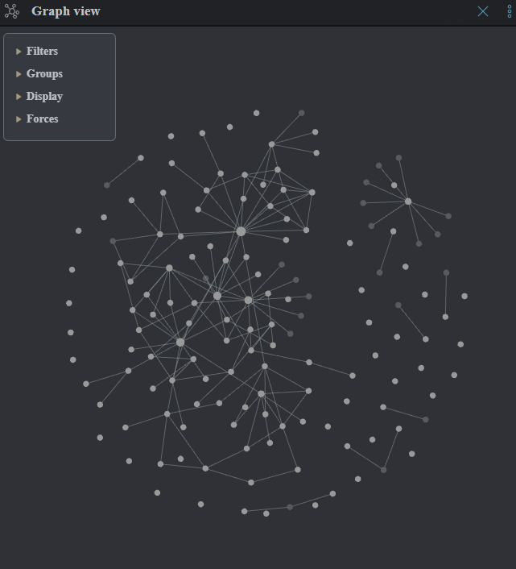
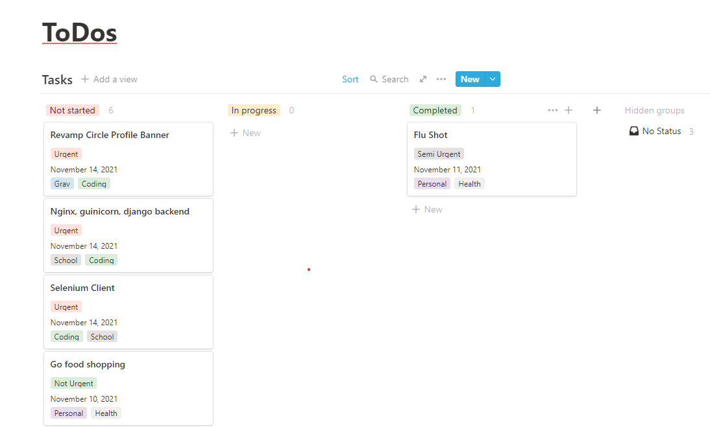

# How to take notes efficiently, and some note taking tools

Computer science is a difficult dicipline to take notes in. This is because it is simply built different from other subjects. CS is very process based, where you are learning a series of steps that contribute to some end result. This makes it hard to study with, say, flash cards. However, there are a few strategies for taking notes that have helped me do fairly well in my studies thus far:

**I highly reccomend taking notes by hand**
Think about it, if you type your notes, how will you draw the binary search tree example the professor drew on the board? Many of the data structures and processes taught in CS can be drawn, and often, on exams, you will be asked questions that include drawings. The ability to draw and translate course content into consise images is an important skill to develop.

**Try not to copy the powerpoint**
This one has a catch. Only do this if your professor uploads his/her slides. However, assuming they do, you theoretically have no need to copy any of the slide's content, since it is available for you to view at any time. 

**Be an active listener**
This is super useful. Essentially, your goal in lecture should be to closely listen to what the professor is saying and ask as many thoughtful questions as possible. This has numerous benefits. It will increase your understanding of the course content, allow you to develop a relationship with your professor, and ultimately get you thinking about the course content in a more meaningful way.

**What to actually write down**
I suggest you write down any pictures/drawings the professor draws/shows in their slides. I suggest you do not copy definitions of things word for word, instead copy a sentence/point that uses a new word in it. Then, when you review your notes, you will often find that the definition will just come back to you, and if not, you can always refer to the professor's powerpoint/Google. The most important thing to copy is problem/solutions. If the professor ever defines a problem then explains how computer scientists typically solve that problem, it is safe to assume that is likely important information. One example of a problem/solution that you may have even heard in class is, "After inserting this node into the red black tree shown on the board, the tree will no longer be balanced. Thus, we must perform a right rotation and recolor."

## Note taking tools

There are seemingly infinite innovative tools for helping students take/organize their notes. I'll mention a few I have used here.

**Obsidian**
Obsidian is perhaps the most useful piece of software for any computer science student. It allows you to take notes in markdown, but the catch is, you can add wiki links to other markdown files. You can then view a graph of all of your connected markdown files, where the edges represent links between two concepts. 

I use obsidian to organize my notes, not to take them. After a lecture, I spend 20-30 minutes translating my hand written notes into my obsidian vault, taking time to think about how to organize everything. This greatly helps in creating new links between concepts.

There are many resources available that detail innovative ways to structure one's obsidian vault. I would suggest browsing some youtube videos to get an idea of what other people do, then create a system that works for you using theirs as inspiration. I loosely base my system off of the Zettelkasten method, but there are many different ideas out there.

**Notion**
Notion is another markdown editor that can be useful for storing notes. My issue with Notion is that your files are not stored locally: they are stored on some cloud server somewhere. Thus, if you are taking notes on, say, a sensitive research project and Notion gets hacked, that could be very damaging to the project. 

Regardless, Notion is a solid alternative to Obsidian. Granted, you don't get the graph view, but Notion has a lot of features that Obsidian doesn't that could be quite useful. Namely, you can share Notion pages with your peers, and edit them together in real time, like Google Docs. This can be useful for taking notes while building a project, or for collaborating on a study guide.

Notion is also objectively easier to learn than Obsidian. Obsidian does not have many drag-and-drop interfaces; everything you do would have to be "coded" in markdown. Notion, however, is a lot easier to navigate, and they include a lot of useful tools that make it easy to write good-looking notes.

I typically use Notion for things other than notes. For instance, I use the kanban board feature to structure my ToDo list. Additionally, the fact that you can share Notion pages with peers makes it a great site to organize project tasks and stay in touch about progress made. Here is a brief glimpse into what you can do with Notion:

**GoodNotes and OneNote**
These are, in my opinion, the same app. They both allow you to take handwritten notes on a tablet. If you are deciding between the two, my only complaints are that GoodNotes is not free (I think it is $5), and OneNote makes it hard to type text. While you would ideally be handwriting most of your notes, the ability to type would still come in handy once in a while, and I personally hate their interface for typing notes.

I would also consider what brand of technology you use. GoodNotes is an app on the Apple app store, and can be downloaded on Mac, iPhone, and iPad. OneNote is a Windows application, and can be downloaded on almost anything. The catch is, you can't (to my knowledge) get GoodNotes on a Windows computer. Thus, if you want to be able to send your notes to your Windows desktop, I would lean towards OneNote.
