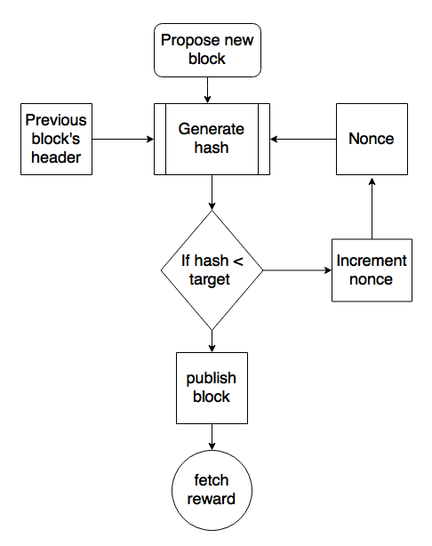

# What is blockchain?

At its most basic, a blockchain is a list of transactions that anyone can view and verify. The Bitcoin blockchain, for example, contains a record of every time someone sent or received bitcoin.

### An analogy, curtesy of coinbase.com
> Picture a chain you might use for a ship’s anchor. But in this case, every link on the chain is a chunk of information that contains transaction data. At the top of the chain you see what happened today, and as you move down the chain you see older and older transactions. And if you follow it all the way down to the anchor sitting at the bottom of the harbor? You’ll have seen every single transaction in the history of that cryptocurrency. Which gives the blockchain powerful security advantages: it’s an open, transparent record of a cryptocurrency’s entire history. If anyone tries to manipulate a transaction it will cause the link to break, and the entire network will see what happened. That, in a nutshell, is blockchain explained.

### A walk down the eternal, immutable life of a block on a blockchain.
*We will look at Bitcoin in this example, however the process is similar, if not the same, for any blockchain.*

Let's say you buy a bitcoin from someone. This transfer of a bitcoin is entered and transmitted to a large network of powerful computers called **Nodes**.

Each node maintains a copy of the blockchain. In the case of bitcoin, each node would have a copy of the list of every bitcoin transaction dating back to the dawn of time. Nodes are responsible for approving new transactions, an action that is called **mining**.

The act of mining is not complex. It is merely a guessing game. However, in the case of bitcoin, the odds that you guess correctly is one in the tens of trillions.

Once a node confirms a transaction, it is permanently added to a block on the blockchain. Once the majority of the network confirms this new block addition, it is permanently added to the front of the blockchain.

### If blockchains are simply a record of transactions, what are people actually transacting?
*Again, we will use bitcoin to answer this.*

Miners receive bitcoins for mining blocks on the blockchain. This cycle essentially mints new currency as existing currency is transacted. Bitcoins are essentially complex computer files that can be linked to one's address.